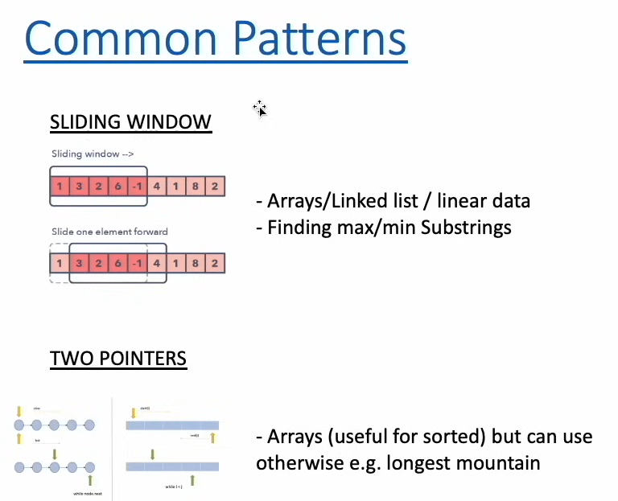

# *** 2 POINTER PROBLEMS ***
####  8.) 121. Best Time to Buy and Sell Stock

        def maxProfit(self, prices: List[int]) -> int:
        min_value = float('inf') # Setting it to max
        max_value = 0
        
        for i in range(len(prices)):
            if prices[i] < min_value:
                min_value = prices[i]
            elif prices[i] - min_value > max_value:
                max_value = prices[i] - min_value
                
        return max_value
        # Here we assue that Min Value - inf is the maximum number that we have
        # and max_value is out solution, now list's first element becomes min_value
        # and so on, 
        # This is a Single Pointer Greedy Algorithm

#### 2 pointer solution for the same.

    def maxProfit(self, prices: List[int]) -> int:
        l = 0
        r = 1
        max_profit = 0

        while r != len(prices):

            if prices[l] < prices[r]:
                profit = prices[r] - prices[l]
                max_profit = max(max_profit, profit)
            else:
                l = r
            
            r += 1

        return max_profit
    # Greedy Algorithm, 2 pointer solution, O(N), O(1)

#### 9.) 977. Squares of a Sorted Array

    def sortedSquares(self, nums: List[int]) -> List[int]:
        
        right = len(nums) - 1 
        left = 0
        res = collections.deque()
        while left <= right:
            if abs(nums[left]) > abs(nums[right]):
                res.appendleft(nums[left] ** 2)    
                left += 1
            else:
                res.appendleft(nums[right] ** 2)    
                right -= 1
        return list(res)
        
        # TWO Pointers Solution,
        # The real trick here is to take the right pointer as End Value
        # and appending LEFT, as the list is sorted we know the extreme element
        # has to be the largest element. :(

#### 10.) 15. 3Sum

    def threeSum(self, nums: List[int]) -> List[List[int]]:
        result = []
        nums.sort()
        for i, val in enumerate(nums):

            if i > 0 and val == nums[i-1] or val > 0:
                continue

            left, right = i + 1, len(nums) - 1

            while left < right:
                total = val + nums[left] + nums[right]
                if total == 0:
                    result.append([val, nums[left], nums[right]])
                    left += 1
                    # to keep evaluating further
                    while left < right and nums[left] == nums[left - 1]:
                        left += 1
                elif total > 0:
                    right -= 1
                elif total < 0:
                    left += 1

        return result
        
        # Time Complexity - O(N2) 
        # Space - O(N) 
        # Trick here is using sorting and then 2 sum
        # for each element of the main for loop, do 2sum on the remaining subarray
        # duplicates can be avoided if we skip same element of main loop
        # anything greater than 0 need not to be evaluated as 0,1,2 can never be equal to 0

#### 11.) 845. Longest Mountain in Array
        res = 0
        # Starts from the 1st element, like a sliding window of 3 elements, where idx is at the middle
        for i in range(1, len(arr) - 1):

            if arr[i-1] < arr[i] > arr[i+1]:
                # A Peak
                l = r = i

                while l > 0 and arr[l] > arr[l-1]:
                    l -= 1
                
                while r < len(arr) - 1 and arr[r] > arr[r + 1]:
                    r += 1
                
                res = max(res, r-l+1)
        
        return res
        # avg case O(N), worst case O(N2) for 1,2,1,2,1,2,1,2 type of input
        # space is O(1),
        # TRICK here is 2 pointers again and imagining a Peak (sliding window of 3 items)

# *** Sliding Window Problems ***

#### 12.) 219. Contains Duplicate II
    def containsNearbyDuplicate(self, nums: List[int], k: int) -> bool:
        track = dict()

        for idx, num in enumerate(nums):
            if num not in track:
                track.update({num: idx})
            elif abs(idx - track[num]) <= k:
                return True
            else:
                track.update({num: idx})

        return False 

    
    # SLIDING WINDOW SOLUTION
    def containsNearbyDuplicate(self, nums: List[int], k: int) -> bool:
        track = set()
        for idx, num in enumerate(nums):
            if num in track:
                return True
            else:
                track.add(num)
            if len(track) > k:
                # Sliding Window is maintained here
                track.remove(nums[idx - k])
        
        return False

#### 13.) 1200. Minimum Absolute Difference

    def minimumAbsDifference(self, arr: List[int]) -> List[List[int]]:
        result = []
        min_diff = float('inf')
        arr.sort()

        for idx in range(1, len(arr)):
            min_diff = min(min_diff, arr[idx] - arr[idx - 1])

        for idx in range(1, len(arr)):
            if arr[idx] - arr[idx - 1] == min_diff:
                result.append([arr[idx - 1], arr[idx]])

        return result

    # The trick here is sliding window and SORTING
    # Quite simple if you know the min diff
    # TIME COMPLEXITY - NlogN, SPACE - O(N)

#### 14.) 209. Minimum Size Subarray Sum

    def minSubArrayLen(self, target: int, nums: List[int]) -> int:
        left = 0
        res = float('inf')
        curr_sum = 0
        
        for right in range(len(nums)):
            curr_sum += nums[right]    
            
            while curr_sum >= target:
                res = min(res, right+1-left)
                curr_sum -= nums[left]
                left += 1
                
        if res != float('inf'):
            return res
        else:
            return 0
    
    # Trick here is sliding window and 2 pointers
    # O(2N) -- O(N), O(1)

##### 15.) Onwards on Bit Manipulation File