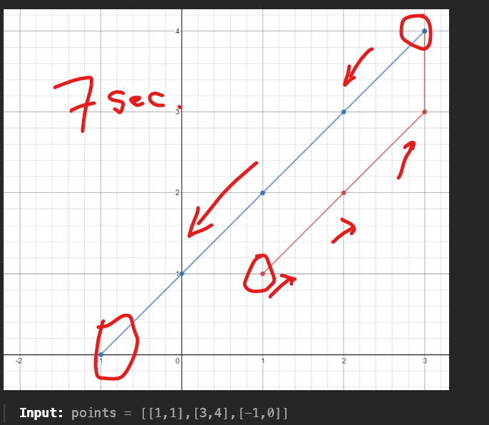

#BIG O - Reference Chart

# BIG O Summary

# Problem Solving

# **** Problems *** 

### Arrays 

1.)  217 - Contains Duplicate --> 

    # I converted the list to set, as set never has a duplicate value, 
    # So if their lengths are unequal then there is a duplicate else there is no duplicate
    return True if len(set(nums)) != len(nums) else False 
    # SET is the TRICK here

2.) 268 - Missing Number
    
    Input: nums = [3,0,1]
    Output: 2

    for idx, num in enumerate(sorted(nums)):
        if idx != num:
            return idx
    else:
        return idx + 1
    # NLOGN
    # OR 
    return sum(range(len(nums)+1)) - sum(nums)
    # N runtime ( sabka sum krte to kya aata VS abhi kya aa rha hai, so difference is the answer)
    # MATHS is the TRICK here

3.) 448. Find All Numbers Disappeared in an Array

    Given an array nums of n integers where nums[i] is in the range [1, n], 
    return an array of all the integers in the range [1, n] that do not appear in nums.
    Input: nums = [4,3,2,7,8,2,3,1]
    Output: [5,6]

    res = []
    nums_set = set(nums)
    for num in range(1, len(nums) + 1):
       if num not in nums_set:
            res.append(num)
    
    return res
    # SET is the TRICK HERE 

4.) 1365. How Many Numbers Are Smaller Than the Current Number
    
    Input: nums = [8,1,2,2,3]
    Output: [4,0,1,1,3]
    Explanation: 
    For nums[0]=8 there exist four smaller numbers than it (1, 2, 2 and 3). 
    For nums[1]=1 does not exist any smaller number than it.
    For nums[2]=2 there exist one smaller number than it (1). 
    For nums[3]=2 there exist one smaller number than it (1). 
    For nums[4]=3 there exist three smaller numbers than it (1, 2 and 2).

    def smallerNumbersThanCurrent(self, nums: List[int]) -> List[int]:
        res = []
        d = {}
        for idx, num in enumerate(sorted(nums)):
           if num not in d:
            d[num] = idx
        
        for num in nums:
            res.append(d[num])
        
        return res

    # just like TWO SUM we used dictionary, 
    # SORTING and HASHMAPS is the Trick here though

5.) 1266. Minimum Time Visiting All Points
        

        # We run a loop from 1st point to 2nd last point,
        # We found out (magically) mathematically that in order to go from point
        # (1, 1) to (3, 4), the amount of time it takes is max difference between the two points
        # 3 - 1 = 2 OR 4 - 1 = 3, hence we choose 3
        # Similarly for (3, 4) to (-1, 0) we have
        # -1 - 3 = -4 OR 0 - 4 = -4, abs of which is 4
        # res = 3 + 4 = 7 seconds

        def minTimeToVisitAllPoints(self, points: List[List[int]]) -> int:
        total_time = 0
        for idx in range(0 ,len(points) - 1):
            curr = points[idx]
            tar = points[idx + 1]
            total_time += max(abs(tar[0] - curr[0]), abs(tar[1] - curr[1]))

        return total_time
        # MATHS is the TRICK here

6.) 54. Spiral Matrix - List's += operation is like doing extend, It needs a list though += list

    def spiralOrder(self, matrix: List[List[int]]) -> List[int]:
        res = []
        # res = [1,2,3,4,8,12,16,15,14,13,9,5,6,7,11,10]
        while matrix:
            res.extend(matrix.pop(0))

            if matrix and matrix[0]:
                for mat in matrix:
                    res.append(mat.pop())
            
            if matrix:
                res.extend((matrix.pop()[::-1]))

            # This is for larger Matrix Cases, That we didn't see
            if matrix and matrix[0]:
                for row in matrix[::-1]:
                    res.append(row.pop(0))

        return res
    # PATTERN is the TRICK here. 
    # Once we have added the outer box, the loop starts again, 
    # like a recursion working on a smaller box

### 7.) Problem on BFS - 200. Number of Islands

### 8.), 9.), 10.), 11.) Problem on Two Pointers and Sliding Window - 

